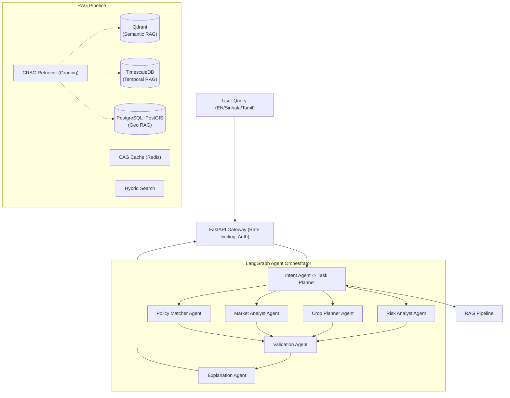

# AgroMind AI 🌾🤖

**Agentic RAG System for Sri Lankan Agricultural Intelligence**

AgroMind AI is a production-grade, multi-agent AI system designed to provide localized, multilingual agricultural intelligence to Sri Lankan farmers. Built entirely on open-source infrastructure (except for the highly cost-effective Google Gemini API), it processes natural language queries in English, Sinhala, and Tamil to answer questions about disease risks, crop planning, market prices, and government policies.

## 🌟 Key Features
- **Multilingual Support**: Processes queries and generates culturally appropriate farmer-friendly responses in English, Sinhala, and Tamil.
- **Agentic RAG Architecture**: Utilizes LangGraph to orchestrate specialized agents (Intent, Risk, Planner, Market, Policy, Validation, Explanation).
- **Hybrid & Geo-Temporal Retrieval**: Queries semantic vectors (Qdrant), temporal weather/market data (TimescaleDB), and spatial geographic data (PostgreSQL + PostGIS).
- **Corrective RAG (CRAG) & Cache Augmented Generation (CAG)**: Pre-evaluates chunk relevance and caches frequent queries in Redis for sub-second response times and cost savings.
- **Robust Ingestion Pipeline**: Auto-scrapes government portals, extracts text from PDFs (with OCR fallback), and employs rigorously evaluated chunking strategies.

---

## 🏗 System Architecture & Implementation Design

The AgroMind AI architecture is divided into decoupled, highly cohesive modules handling specific aspects of the intelligence pipeline.

### 1. Data Ingestion Pipeline
The ingestion system asynchronously collects, cleans, and vectorizes heterogeneous agricultural data:
- **Crawlers (Playwright/Celery)**: Automatically scrape the Department of Agriculture (DOA) and HARTI websites for PDFs, handling JavaScript-heavy pages and implementing robust retry logic.
- **Extraction & OCR**: PyMuPDF extracts text, falling back to PaddleOCR for scanned governmental documents.
- **Metadata Tagging**: Gemini 1.5 Flash auto-tags documents with crops, districts, and topics to enable rich filtering in the vector store.
- **Chunking (LlamaIndex)**: Employs 5 rigorously evaluated chunking strategies (Fixed, Sliding, Semantic, Parent-Child, Late) tailored to different document structures.
- **Databases Setup**: Semantic text goes to Qdrant, chronological weather/market data to TimescaleDB, and district boundaries/soil profiles to PostGIS.

### 2. The RAG Pipeline (CAG & CRAG)
- **Cache Augmented Generation (CAG)**: Before any LLM processing, Redis is checked for semantically identical past queries to provide instantaneous responses.
- **Hybrid Search**: Fuses dense contextual embeddings (`text-embedding-004`) with BM25 sparse vectors.
- **Reranker**: A cross-encoder (`ms-marco-MiniLM-L-6-v2`) precisely reranks the retrieved chunks.
- **Corrective RAG (CRAG)**: An LLM dynamically grades each retrieved chunk (Relevant, Partial, Irrelevant), filtering out hallucination-inducing noise before agent processing.

### 3. LangGraph Agent Orchestrator
The core intelligence layer utilizes LangGraph for a deterministic, directed acyclic graph (DAG) multi-agent workflow:
1. **Intent Agent**: Classifies user queries (e.g., Disease, Planning, Market, Policy) and routes them to specialized handler agents.
2. **Parallel Sub-Agents**: 
   - *Risk Analyst*: Correlates current weather from TimescaleDB with established pest/disease parameters.
   - *Crop Planner*: Handles agronomic planning and fertilizer regimes.
   - *Market Analyst*: Compares current prices against historical trends.
   - *Policy Matcher*: Checks eligibility for subsidies based on user metadata.
3. **Validation Agent**: Cross-references sub-agent outputs against deterministic, rule-based agronomic constraints (e.g., max nitrogen limits for Paddy in `crops.yaml`) to eliminate hallucinations.
4. **Explanation Agent**: Synthesizes the validated output into accessible, jargon-free English, Sinhala, or Tamil.



---

## 🛠 Tech Stack

| Category | Open-Source Tools / Paid Services |
|----------|-----------------------------------|
| **LLM & Embeddings** | Google Gemini 2.5 Flash, `text-embedding-004`, `sentence-transformers` |
| **Vector & DBs** | Qdrant, TimescaleDB, PostgreSQL, PostGIS, Redis |
| **Agent Framework** | LangGraph, mem0 (episodic memory) |
| **Ingestion Pipeline**| Playwright, PyMuPDF, PaddleOCR, Celery, LlamaIndex |
| **Evaluation** | RAGAS, MLflow, LangSmith |
| **Backend API** | FastAPI, Celery Beat |
| **Frontend UI** | React, Vite, Recharts, Leaflet.js |
| **Infra & Monitoring**| Docker Compose, Prometheus, Grafana, Loguru |

---

## � Docker Container Architecture

AgroMind AI utilizes a microservices architecture entirely orchestrated via Docker Compose (`docker-compose.yml`), ensuring seamless local development and production equivalence.

1. **`api` (FastAPI)**: The main entry point. Exposes REST endpoints for query processing, simulation, and ingestion triggers. Integrates LangGraph and manages state.
2. **`worker` (Celery)**: Background worker responsible for heavy asynchronous tasks, primarly the data ingestion pipeline (PDF extraction, OCR, embedding generation).
3. **`beat` (Celery Beat)**: A singleton scheduler that orchestrates periodic tasks (e.g., weekly market price scraping or daily weather ingestion).
4. **`ui` (React/Vite)**: The interactive dashboard exposing query panels, agent reasoning traces, Leaflet-based district maps, and Recharts market trends.
5. **`qdrant`**: The high-performance semantic vector database managing document embeddings and sparse vectors for hybrid retrieval.
6. **`timescaledb`**: A robust PostgreSQL instance augmented with TimescaleDB for time-series weather/market data and PostGIS for spatial district boundary evaluation.
7. **`redis`**: The multi-purpose in-memory datastore acting as the Celery message broker, LangGraph state checkpointer, and the high-speed Cache Augmented Generation (CAG) cache layer.
8. **`mlflow`**: Evaluation tracking server used to benchmark different RAG chunking strategies using RAGAS metrics.
9. **`prometheus` & `grafana`**: The monitoring stack. Prometheus scrapes metrics (latency, cache hit rate) from the FastAPI app, visually rendered by Grafana dashboards.

---

## �📁 Repository Structure

```text
agromind-ai/
├── 📁 ingestion/      # Data collection pipelines (Crawlers, Extractors, Chunkers)
├── 📁 knowledge/      # RAG layer (Embedders, Retrievers, CRAG, CAG cache)
├── 📁 agents/         # LangGraph Agent definitions (Intent, Risk, Planner, etc.)
├── 📁 orchestration/  # LangGraph DAG state machine, edges, and checkpoints
├── 📁 memory/         # Regional and episodic decision memory stores
├── 📁 api/            # FastAPI backend, routers, and middlewares
├── 📁 evaluation/     # RAGAS benchmarks, CRAG evaluation, CAG cache simulations
├── 📁 config/         # System settings, Prompts YAML, crops/district metadata
├── 📁 monitoring/     # Prometheus configs and Grafana dashboards
├── 📁 ui/             # React + Vite frontend dashboard (Leaflet Map, Recharts)
├── 📁 tests/          # Unit, integration, and E2E test suites
└── docker-compose.yml # Full local infrastructure stack
```

---

## 🚀 Getting Started

### 1. Prerequisites
- Docker & Docker Compose
- Python 3.10+
- Node.js 18+
- Google Gemini API Key

### 2. Environment Variables
Copy `.env.example` to `.env` and fill in the required keys:
```bash
cp .env.example .env
```
Key required variable: `GEMINI_API_KEY`.

### 3. Running with Docker Compose
To easily spin up the complete infrastructure (all 9 microservices):

```bash
docker-compose up -d --build
```
This single command spins up Postgres, Timescale, PostGIS, Qdrant, Redis, API, Celery Workers, MLflow, Prometheus, Grafana, and the Frontend.

### 4. Running Locally (Development without Docker)
If you prefer running the Python and Node services bare-metal (requires local Postgres/Redis/Qdrant):
```bash
# 1. Install Python dependencies
pip install -r requirements.txt

# 2. Run the FastAPI Application
uvicorn api.main:app --host 0.0.0.0 --port 8000 --reload

# 3. Start Frontend UI
cd ui
npm install
npm run dev
```

---

## 📈 Evaluation & Optimization

AgroMind AI was rigorously evaluated using modern LLMOps practices:
1. **Chunking Strategies**: 5 different chunking strategies were evaluated via **RAGAS** (Faithfulness, Answer Relevancy, Context Recall), tracking results in **MLflow**.
2. **Cache Simulation**: A 100-query Zipf-distributed simulation proved the **Cache Augmented Generation (CAG)** layer yields massive speedups and cost-savings for seasonal questions.
3. **Agent Tracing**: The complete reasoning trace of the LangGraph multi-agent flow is tracked and debugged using **LangSmith**.

---

## 📡 Example API Usage

**Query Endpoint:** `POST /api/v1/query`

```bash
curl -X POST "http://localhost:8000/api/v1/query" \
     -H "Content-Type: application/json" \
     -d '{
           "query": "Is there a blast risk for rice in Anuradhapura right now?",
           "district": "anuradhapura",
           "crop": "paddy",
           "language": "english"
         }'
```

**Response Output:** Includes the direct answer, confidence score, risk levels, and a complete sub-agent reasoning trace.
